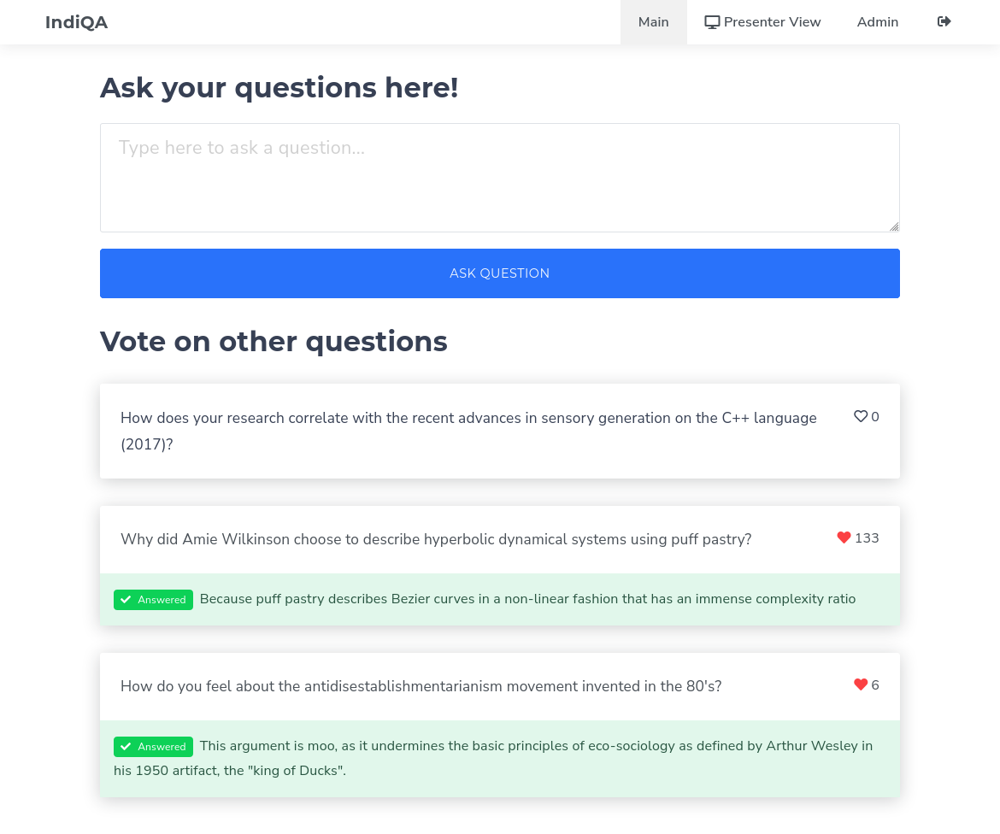
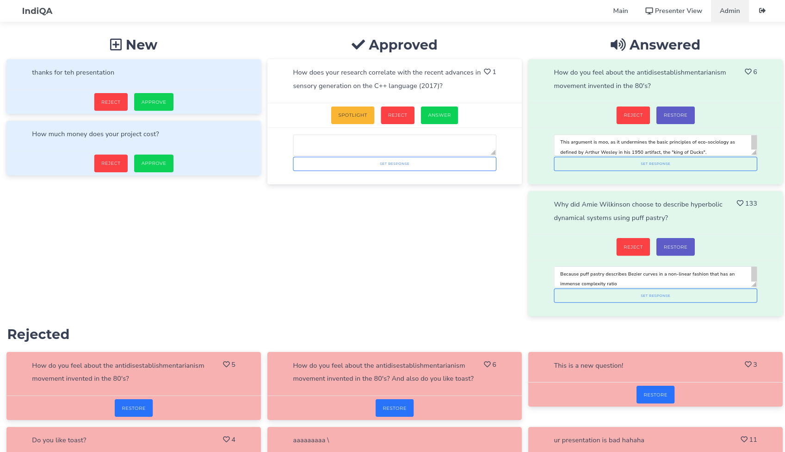
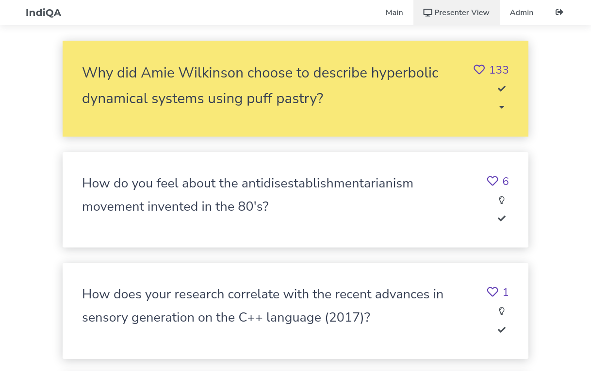

# indiQA
A Q&A platform for conferences and workshops. Quickly manage questions during presentations (on-site or remote) without the hassle of microphones, mobile apps or miscommunication! 

## Features
- User-friendly page to ask questions immediately
- No registration required
- Voting on popular questions
- Questions are moderated by administrators
- Presenter view for large screens
- Answer questions in text
- Instant updates based on WebSockets

## Screenshots






## Usage

indiQA is built on top of [Meteor.js](https://www.meteor.com/), so you will need to get some Javascript running on your computer to execute it.

First, make sure you have Node.js 14 installed. [nvm](https://github.com/nvm-sh/nvm) is a popular choice for that.  
Then, you will need to install a few dependencies, and start the project:
```bash
# Use Node.js version 14
nvm use 14

# Download the current version of indiQA
git clone https://github.com/kongr45gpen/indiqa.git
cd indiqa

# Install dependencies
npm install -g meteor
npm install

# Start indiQA development server at port :3000
npm start
```

After you get indiQA running, you can:
1. Browse http://localhost:3000/ and ask your questions
2. Browse http://localhost:3000/login, enter the generated login details, and administrate the questions
